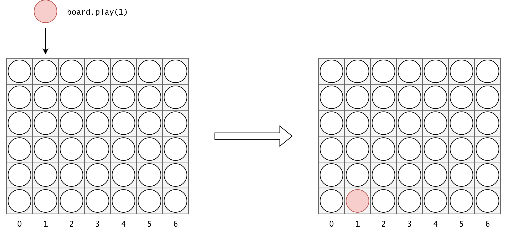
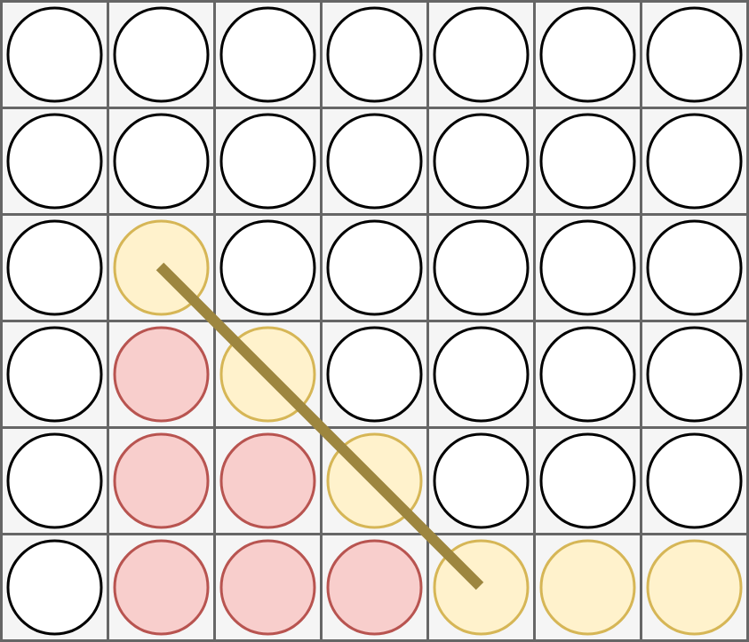
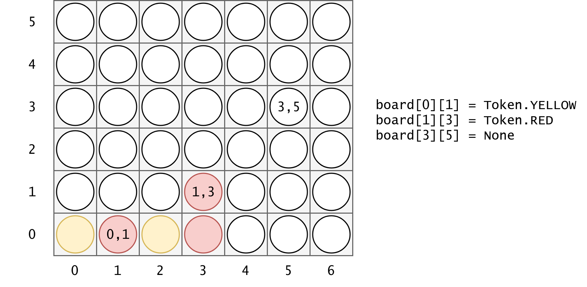

# Programmation 2 - Projet IA

## Consignes administratives

Ce projet est à réaliser sur Github, par groupes de deux. Seul le contenu mis en ligne sur Github sera noté.

La date limite est le **13 mai à 12h00**. Nous ne tiendrons pas compte des commits effectués après cette date.

L'utilisation d'outils d'IA conversationnels type ChatGPT est interdite.
Vous devrez présenter votre travail aux assistants durant 5 à 10 minutes le jour du rendu, durant la session d'exercice.
Une heure de passage vous sera communiquée ultérieurement.

## Présentation du projet

Dans ce projet, qui fait suite à la série notée, votre objectif sera de développer une intelligence artificielle (IA) capable de jouer au jeu Puissance 4.

Votre code devra respecter la spécification donnée pour que nous puissions organiser un tournoi entre les équipes à la fin du projet.

### Rappel - le jeu de Puissance 4

Le jeu de Puissance 4 est un jeu pour deux joueurs qui se joue sur une grille de 6 lignes par 7 colonnes posée verticalement sur une table.
Tour à tour, les joueurs placent un jeton de leur couleur dans une des 7 colonnes dans le but d'aligner 4 jetons de la même couleur sur une même ligne, colonne, ou diagonale.

Comme la grille est disposée verticalement, les joueurs choisissent simplement dans quelle colonne jouer. Le jeton tombe ensuite dans la case la plus basse de cette colonne et reste en place.

La victoire s'obtient lorsque 4 jetons sont alignés.

## Éléments fournis

Nous vous fournissons quatre classes dans le fichier `game_objects.py`. 

- La classe `Token` représente un jeton dans la grille de Puissance 4. `Token.RED` représente un jeton rouge ; `Token.YELLOW` représente un jeton jaune.
- La classe `IllegalMove` est une exception lancée par le jeu lorsqu'un coup illégal est joué.
- La classe `Board` représente une grille de Puissance 4. Elle est caractérisée par ses dimensions (nombre de lignes et de colonnes).
- La classe abstraite `Strategy`, dont vous devrez hériter pour implémenter votre stratégie de jeu.

En outre, nous fournissons en guise d'exemple une stratégie aléatoire, `RandomStrategy`, implémentée dans le fichier `random_strategy.py`.

La classe `Board` fournie ressemble à celle de la série notée. Elle propose les méthodes et attributs suivants :

- Attributs `width`, `height` et `to_win`. Décrivent respectivement la largeur (nombre de colonnes) et la hauteur (nombre de lignes) de la grille, ainsi que le nombre de jetons à aligner pour gagner.
- Méthodes `line(i)` et `column(i)`. Retournent le contenu d'une ligne ou d'une colonne.
- Méthode `box(l, c)`. Retourne le jeton en ligne `l` et colonne `c`. Référez vous au schéma ci-dessous pour un rappel de la signification de ces coordonnées.
- Méthodes `lines()`, `columns()` et `diagonals()`. Retournent un itérateur sur toutes les lignes, colonnes, ou diagonales de la grille (respectivement).
- Méthode `play(column, token)`. Permet de placer un jeton. Attention, **cela modifie la grille de jeu**. Si vous souhaitez simuler un coup, effectuez une _copie_ de l'objet avant d'appeler cette méthode, en utilisant la fonction [`copy.deepcopy`](https://docs.python.org/3/library/copy.html\#copy.deepcopy) fournie dans la bibliothèque standard de Python.
- La méthode `__repr__` est implémentée de sorte à afficher le plateau de jeu. Vous pouvez donc `print(board)` pour afficher l'état du jeu.

### Système de coordonnées d'une grille

## Votre travail

Le but de votre travail est de développer une classe étendant la classe abstraite `Strategy` de sorte qu'elle joue au jeu de manière autonome.

Votre classe **doit** se trouver dans un fichier appelé `team_strategy.py`, et **doit** se nommer `TeamStrategy`.

Vous **devez** implémenter la méthode `name` pour qu'elle retourne le nom de votre équipe, tel que choisi sur GitHub. Si vous êtes seul·e, retournez votre nom d'utilisateur GitHub.

Le coeur de votre stratégie doit être implémenté dans la méthode `play`. Cette méthode sera appelée par notre moteur de jeu. Elle doit retourner un nombre entier représentant le numéro de colonne dans lequel votre stratégie souhaite jouer.

Vous **pouvez** implémenter des fonctions et méthodes annexes. Cependant, **elles doivent se trouver dans le fichier `team_strategy.py`**. En outre, **il n'est pas possible de modifier les classes fournies (dans `game_objects.py`)**. Seuls les modules fournis dans la bibliothèque standard de Python sont autorisés.

Vous êtes libres du choix de la stratégie employée par votre IA. Lors du tournoi, votre joueur déclarera automatiquement forfait si :

- Vous mettez plus d'une seconde à jouer ;
- Vous jouez un coup illégal ;
- Vous générez une exception.

### Tests

Nous fournissons un fichier de tests (`tests.py`) qui permet de vérifier que votre stratégie implémente notre interface correctement. Ce test est très rudimentaire et s'assure simplement que votre stratégie pourra interfacer avec notre code.

Lorsque ces tests s'exécutent sur GitHub, nous les lançons dans un autre dossier, ce qui permet de s'assurer que votre code n'a pas de dépendances externes (c'est à dire que tout le code requis est contenu dans le fichier `team_strategy.py`).
Si vos tests échouent sur GitHub, c'est donc possiblement que vous avez modifié des fichiers fournis ou qu'une partie du code nécessaire à votre IA se trouve hors de votre fichier `team_strategy.py`.

### Moteur de jeu

Nous ne fournissons pas de moteur de jeu pour le Puissance 4.
Nous vous conseillons toutefois d'en implémenter un dans un fichier séparé. 
Vous pouvez réutiliser une partie du code de la série notée - notez cependant que la classe `Board` est légèrement différente.
Vous pouvez également réutiliser telle-quelle la stratégie `KeyboardStrategy` que vous avez du implémenter pour la série notée.

## Évaluation

Votre travail sera noté selon plusieurs critères.
La fonctionnalité et la qualité de votre code sont primordiales.
Votre résultat au tournoi comptera comme bonus.

En plus du rendu de code sur GitHub, vous devrez individuellement écrire un paragraphe sur Moodle pour détailler votre contribution individuelle au projet.
Nous vous demanderons également de venir en groupe durant la session d'exercice le jour du rendu pour expliquer votre code durant 5 à 10 minutes.
